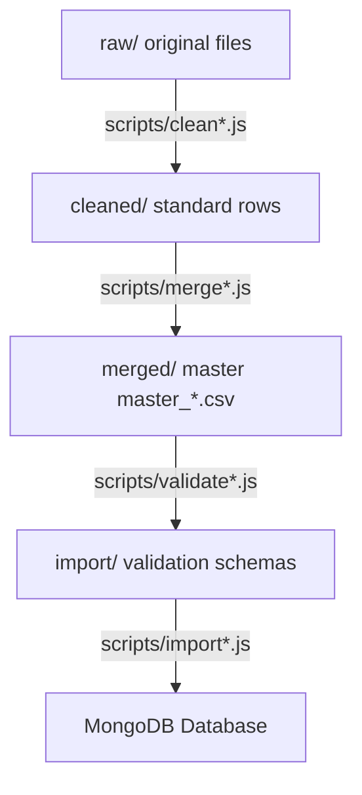

# Healthcare Data Workspace (MediCare Pipeline)

This dedicated workspace is used to collect, organize, clean, merge, validate, and prepare healthcare datasets (hospitals, doctors, labs, and blood banks) before importing them into the MongoDB production database. 

It is completely isolated from the main application codebase to ensure that data processing operations do not interfere with the active running site.

---

## Directory Structure

```
HealthcareData/
├── raw/                      # Original, untouched public datasets (never modify these files)
│   ├── hospitals/
│   ├── bloodbanks/
│   ├── labs/
│   └── doctors/
│
├── cleaned/                  # Cleaned versions of raw datasets
│   ├── hospitals/
│   ├── bloodbanks/
│   ├── labs/
│   └── doctors/
│
├── merged/                   # Master merged files (one combined dataset per entity type)
│
├── import/                   # MongoDB-ready JSON/CSV schemas matching production models
│
├── scripts/                  # Modular node/python data pipeline processing scripts
│
├── logs/                     # Detailed execution logs from cleaning and import stages
│
└── documentation/            # Metadata and source tracking files for every dataset
```

---

## Data Pipeline Workflow



### Stage 1: Raw Collection (`raw/`)
Download datasets from official portals (e.g. data.gov.in, state health department sites) and place them under the corresponding subfolder. **Do not modify these files.**

### Stage 2: Data Cleaning (`cleaned/`)
Run modular cleaning scripts. Cleaning rules to execute:
* Remove duplicate entries.
* Filter empty rows and invalid headers.
* Standardize column headers to lowercase camelCase/snake_case.
* Standardize city and state names to match Nominatim geocoder patterns.
* Normalize phone numbers (e.g., prefixing country code `+91`).
* Remove coordinates that fall outside valid boundary polygons.
* Fix address string formats.

### Stage 3: Dataset Merging (`merged/`)
Combine multiple clean sources for a single entity (e.g. merging government and Private lists) into one master dataset (`master_hospitals.csv`, `master_bloodbanks.csv`, etc.).

### Stage 4: Import Optimization (`import/`)
Convert the merged CSV files into clean JSON arrays or CSV files that exactly align with MongoDB models (e.g., mapping arrays of departments, nesting contact info under `address` structures).

### Stage 5: DB Insertion (`MongoDB`)
Execute validation and import scripts to populate the local or staging MongoDB collections. Always check corresponding execution output logs under `logs/`.
