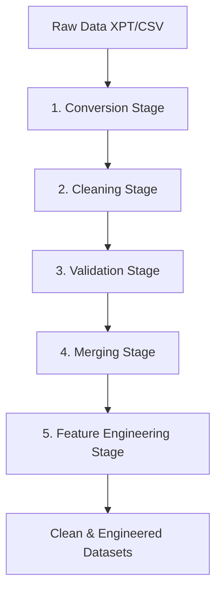

# Preprocessing Pipeline Architecture

This document describes the design, execution sequence, and logical transformations of the MediCare healthcare data preprocessing pipeline.

## Execution Sequence

For complete preprocessing, execute the scripts in the following order:

1. **`run_pipeline.py`** (Master runner that executes all steps automatically)
2. **`scripts/converters/convert_nhanes.py`** (Transforms SAS XPT datasets to CSV)
3. **`scripts/cleaning/clean_*.py`** (Standardizes and handles nulls for domain-specific files)
4. **`scripts/merging/merge_nhanes.py`** (Combines demographics/labs/exams on SEQN key)
5. **`scripts/feature_engineering/extract_features.py`** (Generates risk flags and ratios)

## Stage Details

### 1. Conversion (`convert_nhanes.py`)
- Reads SAS binary files (`.xpt`) using `pandas.read_sas()`.
- Decodes column labels, normalizes types, and outputs flat `.csv` matching original directory nodes.
- Skips already converted files to save disk I/O.

### 2. Cleaning (`clean_*.py`)
- **Deduplication**: Removes multiple identical entries.
- **Outlier Removal**: Truncates clinical values beyond physiologically possible boundaries.
- **Null Imputation**: Fills missing numeric values with columns median, and categorical values with the column mode.
- **String Normalization**: Trims leading/trailing whitespace, converts state/gender keys to standard lower/Title case.

### 3. Validation (`validate_dataset.py`)
- Evaluates cleaned files against schema assertions defined in `config.py`.
- Flags values outside range bounds and logs validation status reports.

### 4. Merging (`merge_nhanes.py`)
- Joins individual NHANES variables (Demographics, Examination, Labs, Questionnaire) per cycle suffix using an `outer` join on patient sequence number `SEQN`.
- Concatenates the merged cycles into a single global cohort file `nhanes_master.csv`.

### 5. Feature Engineering (`extract_features.py`)
- Computes clinical flags and scores: BMI, MAP, Pulse Pressure, sleep/exercise ratings, cholesterol ratios, and risk indicators.
